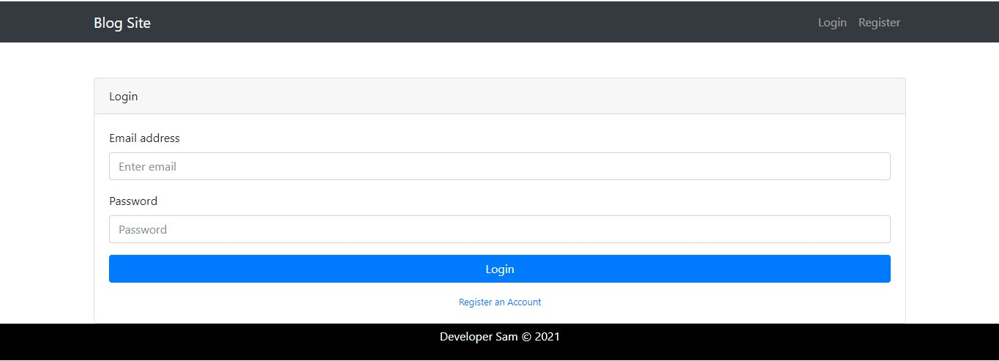
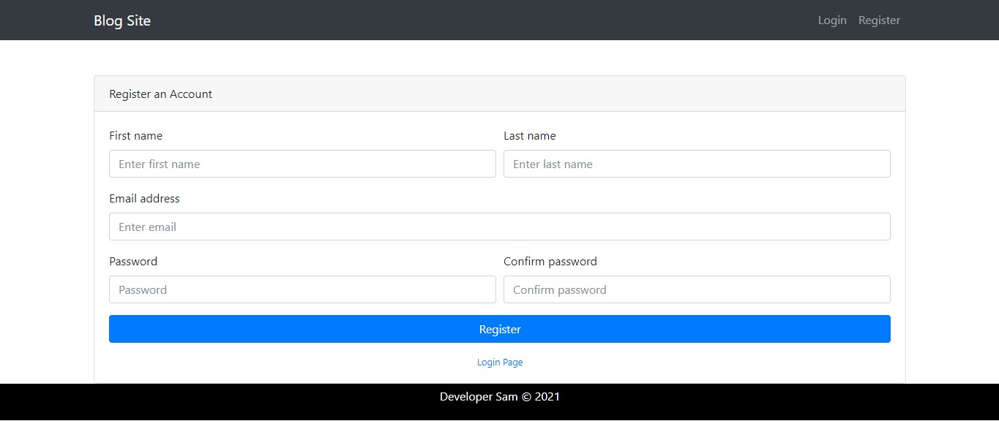
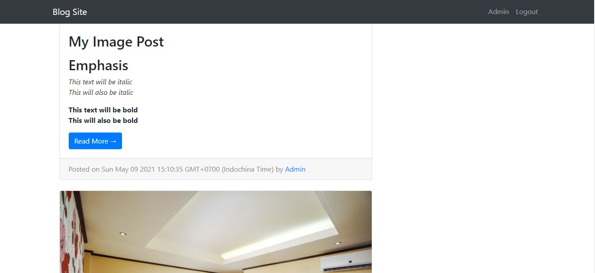
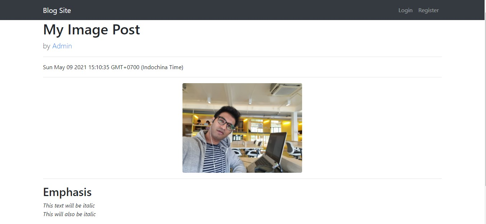
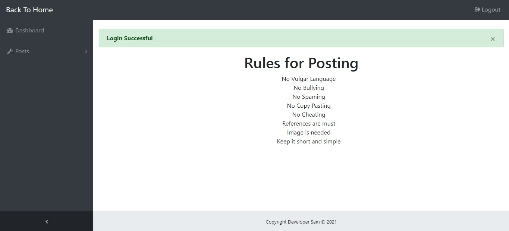
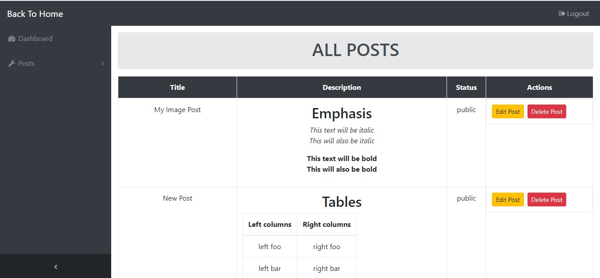
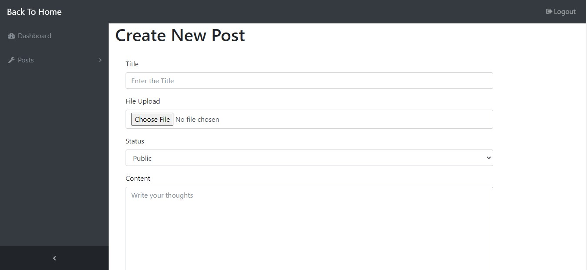

# Blog Site

## Table of Contents

- [About](#about)
- [Live Preview](#livepreview)
- [Features](#features)
- [Run](#run)
- [Maintainers](#maintainers)
- [Contributions](#contributions)
- [Images](#images)
- [License](#license)

## About

Simple blog site project, built with Node.js with the help of Express and Mongoose. Styling is done with the help of [Bootstrap](https://getbootstrap.com/)

> Remember: To run this project follow the prerequisite. After you are done with depdencies simply run ` $ npm run start` to run nodemon

## Live Preview

## Features

- CMS included ✔️
- Upload Images ✔️
- HTML Markup functionality ✔️
- Responsive ✔️
- Authentication ✔️
- Dedicated Admin Panel ✔️

## Run

This project uses [node](http://nodejs.org) and [npm](https://npmjs.com). Go check them out if you don't have them locally installed.
Along with that you would need [mongoose](https://www.mongodb.com/) or you can install it locally. You would also need [Bootstrap](https://getbootstrap.com/), the link is available in my repo.

> Assuming that you have already setup for your mongodb and allowed access and also entered your system's IP ADDRESS.
> To run the project, download the source code and run it in visual studio, then follow the steps

```
$ npm install dotenv
In your config file  require('dotenv').config()
Create .env file in your root folder
Create variables and assign values
```

```
PW = Enter your mongo db password
PORT = Enter your desired PORT number
DBNAME = Enter your mongodb name

```

> run to start server `$ npm run start`
> Go to your browser and type localhost: YOUR PORT NUMBER here ```

## Maintainers

[@DeveloperSamuelAkram](https://github.com/developersamuelakram).

## Contribuitions

Send me a dm [samuelcodes](https://www.instagram.com/samuelcodes/) or create an issue!

## Images

### Login and Register Page




### Homepage



### ReadMore Page



### Admin Panel





## License

[ISC](LICENSE) © Developer Samuel Akram
```
